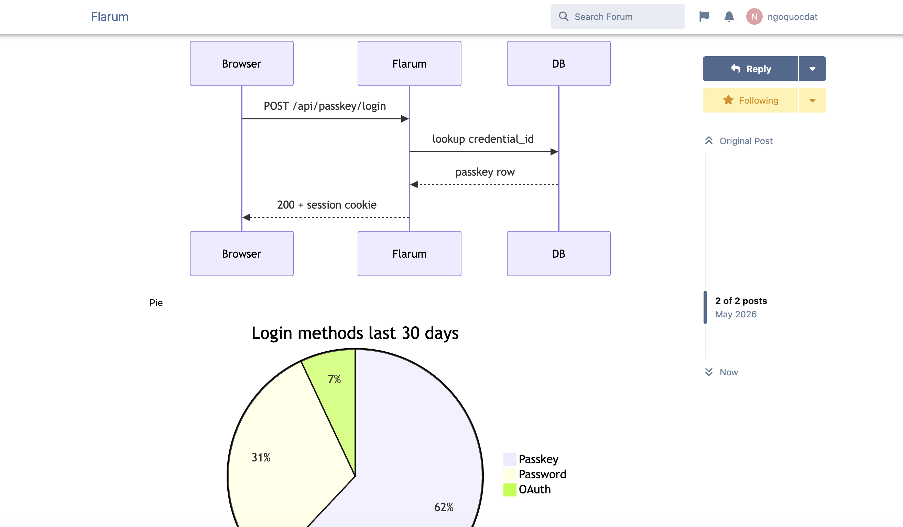
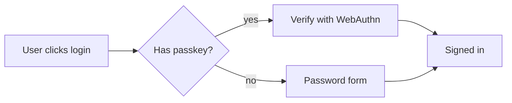

# Flarum Mermaid

[](LICENSE.md)
[](https://packagist.org/packages/datlechin/flarum-mermaid)
[](https://packagist.org/packages/datlechin/flarum-mermaid)

A [Flarum](https://flarum.org) extension that renders [Mermaid](https://mermaid.js.org) diagrams inside posts. Wrap a diagram in a fenced ` ```mermaid ` code block and it shows up as an SVG when the post is read.



## Example

````

````

The mermaid library is fetched from jsDelivr only on pages that contain a diagram, so forums without diagrams pay nothing.

## Installation

```sh
composer require datlechin/flarum-mermaid:"*"
```

## Updating

```sh
composer update datlechin/flarum-mermaid:"*"
php flarum cache:clear
```

## Sponsors

If this extension is useful to you, you can sponsor the work via [GitHub Sponsors](https://github.com/sponsors/datlechin) or [Buy Me a Coffee](https://buymeacoffee.com/ngoquocdat).

## Links

- [Packagist](https://packagist.org/packages/datlechin/flarum-mermaid)
- [GitHub](https://github.com/datlechin/flarum-mermaid)
- [Mermaid](https://mermaid.js.org)
